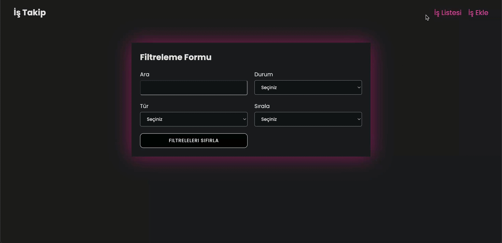

# Task Tracker Project

This project is a task management application designed to simplify the process of tracking tasks. It allows users to filter, sort, add, and delete tasks via API integration. Built with **React** and **Redux Toolkit**, the application ensures a modern and efficient user experience.

## Features

- **Add and Delete Tasks**: Users can easily add new tasks or remove existing ones.
- **Filtering and Sorting**:
  - Tasks can be filtered based on parameters using the filter form.
  - API data can be sorted in `asc` or `desc` order.
- **API Integration**: 
  - API requests are managed using `axios`.
  - `debounced` functionality optimizes API calls to prevent unnecessary requests.
- **Toast Notifications**: User actions trigger real-time notifications.
- **Responsive Design**: Optimized for all devices.
- **Sass**: Advanced styling support.

## Technologies and Libraries Used

- **React**: For building the user interface.
- **Redux Toolkit**: For state management.
- **React Router DOM**: For navigation between pages.
- **Axios**: For handling API requests.
- **React Toastify**: For displaying notifications.
- **JSON Server**: For creating a mock API.
- **Sass**: For managing styles.
- **Debounced Functionality**: To optimize API request handling.

